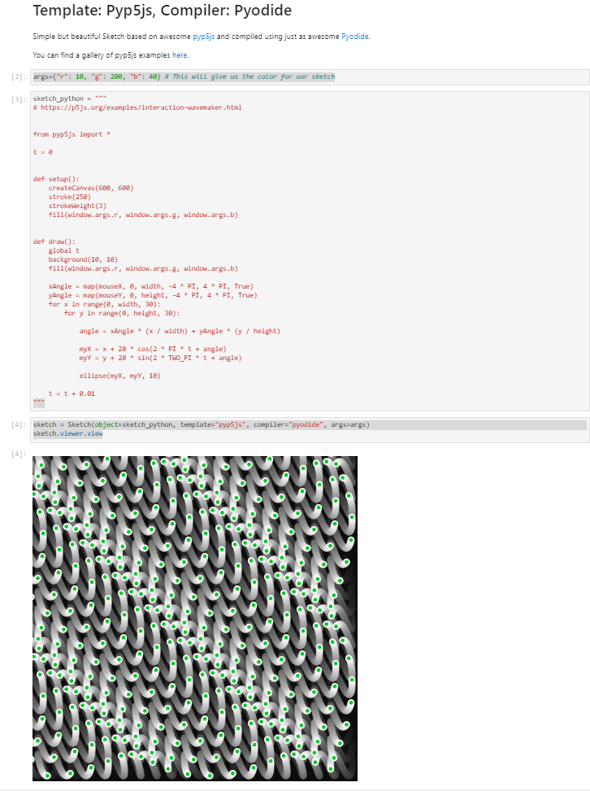

# &#x270f; &#xfe0f; Panel Sketch

THIS IS PRE APLHA SOFTWARE AND YOU CANNOT EXPECT IT TO WORK.

The purpose of the `panel-sketch` package is to make it easy for Pythonistas to quickly sketch interactive visualizations and other applications running in

- the browser. Potentially without a Python backend
- the Jupyter Notebook.
- your favorite editor or IDE.

It is heavily inspired by [p5js](https://p5js.org/get-started/), [p5js sketches](https://editor.p5js.org/p5/sketches) and [pyp5js](https://github.com/berinhard/pyp5js) but not limited to the p5js universe. You can also think of it as a [Code Sandbox](https://codesandbox.io/) or [JS Fiddle](https://jsfiddle.net/) but for #Python &#128013;.

Check out the `panel-sketch` examples on **Binder**

| Jupyter Notebook | Jupyter Labs | Panel Apps |
| - | - | - |
| [](https://mybinder.org/v2/gh/marcskovmadsen/panel-sketch/HEAD?filepath=examples) | [](https://mybinder.org/v2/gh/marcskovmadsen/panel-sketch/HEAD?urlpath=lab/tree/examples) | [](https://mybinder.org/v2/gh/marcskovmadsen/panel-sketch/HEAD?urlpath=panel) |

THE PANEL APPS LINK IS CURRENTLY NOT WORKING. FORM THE JUPYTER LAB ON BINDER YOU CAN START IT MANUALLY IN A TERMINAL USING

```bash
panel serve examples/pyp5js/gallery/gallery.py --static-dirs transcrypt=panel_sketch/sketch_compiler/assets/js/transcrypt/ --port=5007 --allow-websocket-origin=hub.gke2.mybinder.org
```

and open a link similar to `https://hub.gke2.mybinder.org/user/marcskovmadsen-panel-sketch-zods9e4k/proxy/5007/gallery`.

[](https://mybinder.org/v2/gh/marcskovmadsen/panel-sketch/HEAD?urlpath=lab/tree/examples/Sketch.ipynb)

It leverages `Python` to `Javascript` technologies. Currently [Pyodide](https://github.com/pyodide/pyodide) but potentially also [Transcrypt](https://www.transcrypt.org/), [Brython](https://brython.info/) or similar in the future.

## License

The `panel-sketch` python package and repository is open source and free to use (MIT License).

## Installation

With `pip`

```bash
pip install panel-sketch
```

## Usage

```python
import panel_sketch as ps

import panel as pn
pn.extension('Sketch')
```

```python
src = "https://github.com/holoviz/panel/raw/master/doc/_static/logo_stacked.png"
image_style = "height:95%;cursor: pointer;border: 1px solid #ddd;border-radius: 4px;padding: 5px;"
image_html = f""

sketch = Sketch(value=image_html, height=100, width=100)
pn.Column(sketch, pn.Param(sketch, parameters=["clicks"])).servable()
```



## Reference Guides

- [Sketch](https://github.com/MarcSkovMadsen/panel-sketch/blob/main/examples/Sketch.ipynb)

[](https://mybinder.org/v2/gh/marcskovmadsen/panel-sketch/HEAD?urlpath=lab/tree/examples/Sketch.ipynb)

## Examples

Coming up

## Additional Resources

You can find more inspiration via the links below.

- [Panel](https://panel.holoviz.org)
- [Awesome Panel](https://awesome-panel.org)

## Roadmap

When I get the time I would like to

- Support Transcrypt for compiling
- Support [alternatives](https://www.slant.co/options/147/alternatives/~p5-js-alternatives) to p5js like [three.js](https://threejs.org/)
- Support extensions to p5js like [m5.js](https://ml5js.org/)
- Add badges for 100% test coverage etc.
- Distribute as conda package

## Change Log

- 20210410: First Release to PyPi.
